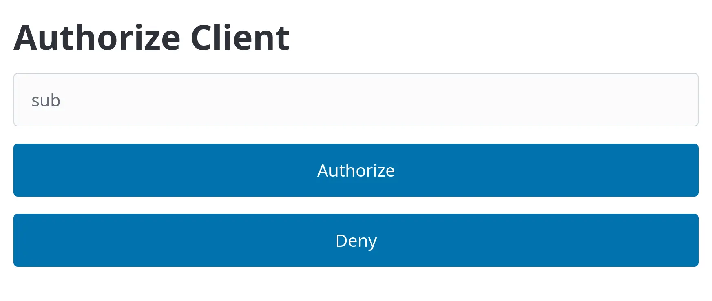

# Usage

## Authorization form

When the user is redirected to the authorization endpoint by the OIDC client
they see the authorization form:

<div class="app-frame mac wireframe" style="margin: 2.5rem 2rem">

</div>

The “sub” input is the user identifier (“subject”) that is included in the ID
token claims and user info response. By default, the value is also used for the
`email` claim. (See also <project:#user-claims>)

## Client registration

By default, the provider works with any client ID and client secret.

The `--require-registration` flag requires client to register with the provider.
A client can be registered using the [OAuth2.0 Dynamic Client Registration
Protocol](https://datatracker.ietf.org/doc/html/rfc7591):

```bash
curl -XPOST localhost:9400/oauth2/clients \
   --json '{"redirect_uris": ["http://localhost:8000"]}'
```

The client ID and secret are contained in the response

```json
{
  "client_id": "050d5966-fb55-4887-a1fe-c9cd27d5386f",
  "client_secret": "yso-fwkXObTx5SEOLPDruQ",
  "grant_types": ["authorization_code", "refresh_token"],
  "redirect_uris": ["http://localhost:8000/"],
  "response_types": ["code"],
  "token_endpoint_auth_method": "client_secret_basic"
}
```

## User claims

By default, only the [OpenID Connect core claims][core claims] and the `email`
claim are returned to the client in the ID token and user info response. The
value entered into the authentication form is used for the `sub` and `email`
claims.

Additional claims can be added to a user identified by their `sub` value through
the <project:#http_put_users> endpoint:

```bash
curl -XPUT localhost:9400/users/alice1 \
   --json '{"email": ["alice@example.com"], "nickname": "Alice"}'
```

If you authenticate as `alice1` the ID token and the user info response will
include the `email` and `name` fields above. Make sure that the client includes
the necessary scopes in the authorization request.

[core claims]: https://openid.net/specs/openid-connect-core-1_0.html#IDToken
